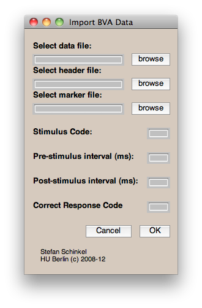

##BVALOADER
load and epoch Brain Vision data - without EEGlab


###About:

I worked a lot with EEG data and do almost everything in Matlab - but I don't use EEGlab. In order to still have a rather convenient access to BrainVision data I wrote some functions to import such data. Note: If you intend to use EEGlab for your analysis anyways, you will be better of using the [bva-io plugin by Andreas Widmann](http://www.uni-leipzig.de/~biocog/content/widmann/eeglab-plugins/)

###Contents:

  * bva_readheader.m - read BrainVision Header (.vhdr) files
  * bva_readmarker.m - read BrainVision Marker (.vmrk) files
  * bva_loadeeg.m - read BrainVision Data (.eeg) files
  * bva_rt.m - extract reaction times from Marker (.vmrk) files
  * bva_epoch.m - epochise continous EEG data (stimulus-locked)
  * bva_epoch2.m - epochise continous EEG data (response-locked)
  * bva_loadsubject.m - wrapper function

###Requirements:

MATLAB (I use/used 2007, 2010a and 2010b but  any recent version should work)

###Example:

Here is a short example how to use the functions. Imagine we have an EEG recording featuring 2 distinct conditions (stimuli classes), for simplicity 1 and 2. Also subjects had to give a response after the stimulus. The correct response is encoded with 100.
Here's how to load such kind of data:
```matlab

% setup filenames, produced by BrainVision Recorder, if
% those are not given, the function will ask for them
headerFile = 'experiment.vhdr';
markerFile = 'experiment.vmrk';

% first get the continuous data as a matlab array
eeg = bva_loadeeg(headerFile);

% meta information such as samplingRate (fs), labels, etc
[fs label meta] = bva_readheader(headerFile);

% read the marker (.vrmk) and store codes
triggers = bva_readmarker('markerFile');

%setup stimlus and response codes
stimCode1 = 1;
stimCode2 = 2;
responseCode = 100;

% and the interval of the segments (trials)
pre = 300;  % 300ms pre-stimulus interval
post = 1000 % 1000ms post-stimulus interval

% epoch continuous data for both stimulus codes,
% and also get the reaction times
[condition1 rt1] = bva_epoch(eeg,trigger,stimCode1,pre,post,fs,responseCode);
[condition2 rt2] = bva_epoch(eeg,trigger,stimCode2,pre,post,fs,responseCode);

% epoch continuous data for both stimulus codes and get reaction times
% but this time locked to the response, not the stimulus
[condition1responseLocked rt1] = bva_epoch2(eeg,trigger,stimCode1,pre,post,fs,responseCode);
[condition2responseLocked rt2] = bva_epoch2(eeg,trigger,stimCode2,pre,post,fs,responseCode);

% or use the GUI
```

### GUI


Note: When using this GUI you need to save the continuous EEG data as a Matlab (.mat) file. If you find that too annoying, drop me a line and I can fix that.

```matlab
% load data reference a vhdr file and save data in MATLAB format
eeg = bva_loadeeg(headerFile);
save eeg.mat eeg;
```

Alternatively, the BrainVision Analyzer can do that for you.


